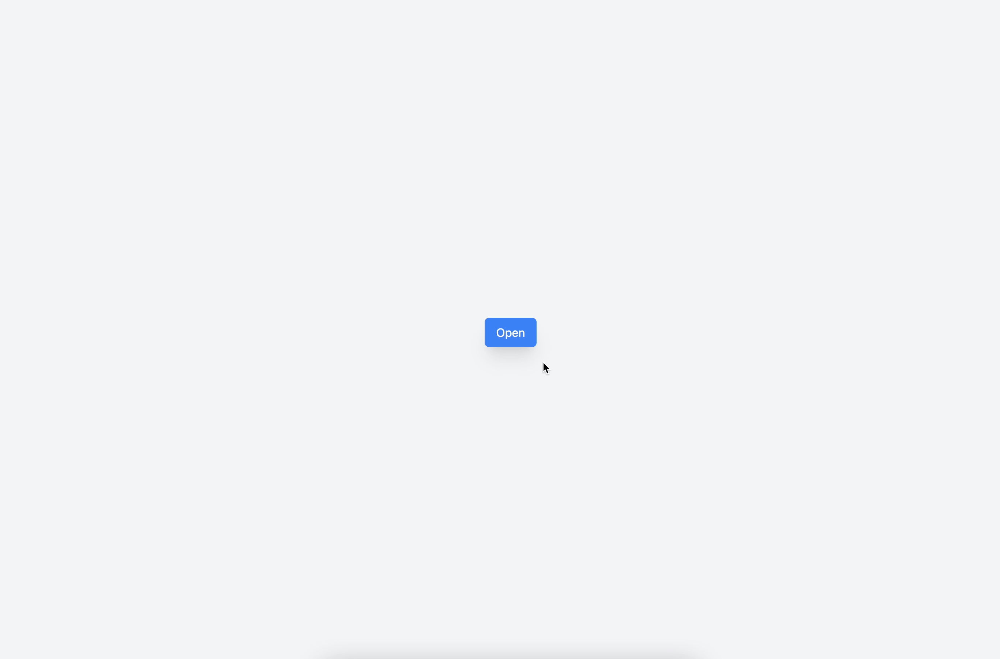

# Gas Fees



- The total fee is calculated by multiplying the max fee by the gas limit. The max fee can be adjusted using the select buttons as well as the slider in the advanced options section.

- The gas fee is retrieved using the Next api, which reads from a local JSON file. Updates to the gas fee update the JSON file.

## How to run locally

1.  Clone this repository.

2.  Navigate to the root directory and install the required packages using `yarn`.

3.  Create a `.env.local` file and add the following variables:

    ```
    NEXT_PUBLIC_ETHERSCAN_API_KEY=<your-api-key>
    ```

4.  Run the app by running `yarn dev`
